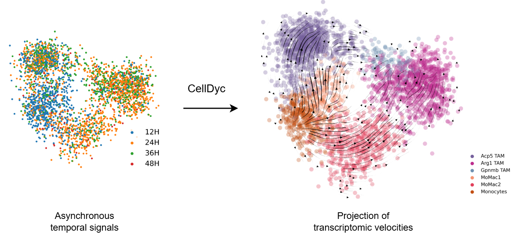

## CellDyc - Experimental Time Points Guided Transcriptomic Velocity Inference

**CellDyc** is a novel semi-supervised learning framework designed to reconstruct transcriptomic velocities and recover intrinsic *gene-embedded time* by leveraging experimental time-point supervision.

  

---

### Key Highlights

- **Data-driven velocity inference**: Robust, data-centric reconstruction of transcriptomic velocities.
- **Intrinsic time recovery**: Recovers intrinsic *gene-embedded time* directly from transcriptomic profiles.
- **Flexible supervision**: Handles sparse and noisy experimental time-point supervision.
- **Seamless integration**: Designed to work with existing computational biology tools and workflows.

---

### Documentation

Installation guide, API reference, and tutorials are available at:

- https://celldyc.readthedocs.io/